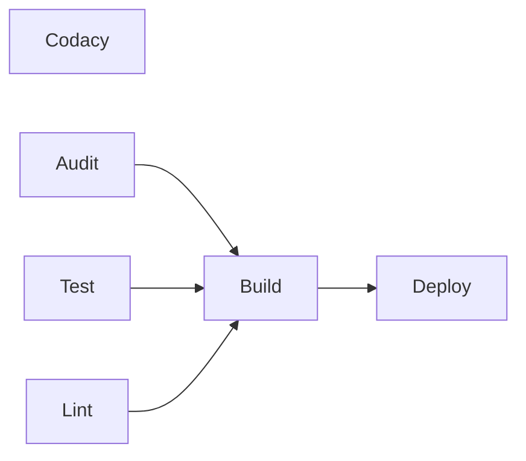
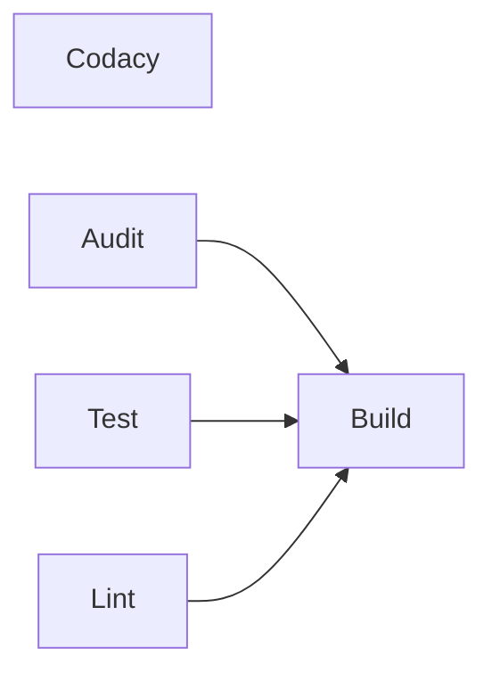

# LiMu (Liberty Munchies)

-----

This repository contains a prototype of the Liberty Munchies website, a networking tool which randomly matches Liberty Mutual employees with others working at their office for an in-person lunch meet-up.

Contributors: [Nida Chacar-Palubinskas](https://github.com/Nida-Chacar-Palubinskas_lmig), [Sarah Simmons](https://github.com/Sarah-Simmons_lmig), [Destiny Wilson](https://github.com/Destiny-Wilson_lmig), [Fatima Orpineda Prieto](https://github.com/Fatima-OrpinedaPrieto_lmig), Ranyeli Frias Tamarez

## Pages:
-----

### Home

A welcome page that displays upcoming meetups.

### Login

Allows users to log in with an email and password or create an account.

### Rewards

Tracks the user's rewards, displaying how many meet-ups until they reach certain achievements. In the final product, each logged-in user would see different pages depending on how many meet-ups they've completed.

### Schedule

Contains a date picker where users can pick any weekday in the next year for their meet-up, a drop down to select the office that they'll be working in, and a schedule button that displays a success message after the user has scheduled. The button also triggers sending an email imitating the match email users would recieve in a final product.

### Profile

Displays the user's name, email, business unit, job title, aligned office, how many lunches they've set up, and how many employees they've met through LiMu.

## NextJS Web UI

-----

This is intended for, and has been tested with, Chrome, Firefox, Safari, and Microsoft Edge.

-----

## Technologies

-----

- [NextJS](https://nextjs.org/docs)
- [React](https://react.dev/)
- [Node](https://nodejs.org/en)
- [Liberty Mutual Design System (LMDS) React Component Library](https://designsystem.lmig.com/)
- [Jest](https://jestjs.io/)
- [React Testing Library](https://testing-library.com/docs/react-testing-library/intro/)
- [Playwright](https://playwright.dev/)

-----

## Application Structure

-----
- `.github/workflows` - Your application's GitHub pipeline-as-code.
- `codacy` - Contains files necessary to run V2 of the Codacy CLI in GitHub Actions.
- `deployment/` - Runtime-specific manifest and configuration files.
- `app/`
  - `[...not_found]` - A catch-all route responsible for rendering 404s.
  - `components` - Non-layout specific components.
  - `health` - `health` route which acts as healthcheck endpoint for our application.
  - `styles` - Global styles and CSS Reset
  - `technologies` - `technologies` route which showcases the different technologies used within our pattern.
- `e2e` - Feature tests that ensure that the application is working as intended.
- `public` - Non-bundled assets for your build (e.g. images).

-----

## Working with GitHub Actions

-----

With the migration to GitHub Actions, users have much more granular control over the development of their applications via workflows.
- These workflows can be triggered manually or occur automatically depending on specific triggers (e.g., `push` to main, `workflow_dispatch`, `pull_request`).
We've created a number of workflows to support your needs, including:
- `evaluate-and-build` - Concurrently performs auditing, linting, and testing of your application. Subsequently builds and uploads your application to Artifactory. Additionally, provides a summary which includes your `build_number`. Action also runs the Codacy CLI and uploads relevant test coverage information to Codacy.
  - This action runs automatically on PR or Push to `main` branch, or can be run manually on branches.
  - A deploy will only occur if you're on the `main` branch to the lowest non-prod environment.
- `deploy` - Deploys the specified build (`build_number`) of your application to the specified environment.
> [!WARNING]
> Be aware that ZScaler's DNS caching can cause delays the first time your application is deployed.

### Automated Workflow
**Main**

**Feature Branch**

### Common Errors
- **SPI Failures**
  - Upon generation or during development, it's possible that you may encounter an SPI Failure when your action is executed.
    - If this occurs, rerun all the failed jobs and your workflow will likely succeed.
- **Adding a New Environment**
  - If you add a new environment to your application post-generation, it's possible that you'll need to make the following changes:
    - `/.github/workflows/automated-workflow.yml` - If you'd like the new environment to be the automated deployment environment, you'll need to update the `deployment-environment` variable.
    - `/deployment/${environment}/secrets.yml` - You'll need to duplicate one of the existing files matching this naming scheme, rename it, and update the appropriate values.
    - `/deployment/${environment}/idp.yml` - You'll need to duplicate one of the existing files matching this naming scheme, rename it, and update the appropriate values.

-----

## Potential Gotchas

-----

> [!CAUTION]
> Due to security concerns, the Architecture Enablement Team recommends that you default to using client-side components.

- One of the key features being introduced within React and NextJS is [React Server Components](https://nextjs.org/docs/app/building-your-application/rendering/server-components) which provides additional features around server-side rendering.
  - Within NextJS, **components are rendered as server components by default**.
    - To indicate a component should be client-side, you need to insert the `"use client"` pragma at the top of your component.
  - React Server Components **do not** have access to any of React's state hooks.
- When using images within NextJS, you need to import the image from the `public` folder and then use that as the source (`src`) location within the `Image` component from `next/image`.
- All of the individual CSS Module files co-located with your components must be `name.module.css` rather than `name.css`. Otherwise, your changes will not take effect.
- NextJS collects telemetry by default.
  - The only way to reliably disable telemetry is to prefix `next` commands with `NEXT_TELEMETRY_DISABLED=1`.
- If you need to utilize an environmental variable to trigger specific actions, please use the `APP_ENV` variable as NextJS sets the `NODE_ENV` based on the `next` command used.
  - `development` for `next dev`.
  - `production` for `next build`.

-----

## Local Development

-----

### Installation

Install dependencies using your package manager of choice. It is recommended that you use [`npm`](https://www.npmjs.com/get-npm).

### Authenticating with JFrog Cloud (packages.lmig.com)

If it's your first time working with the Pipeline 2.0 Artifactory, you'll need to run the following command to store credentials for local development.

```bash
npm login --registry=https://packages.lmig.com/artifactory/api/npm/npm/ --auth-type=web
```

### Working with Certificates

In order to interact with applications and services managed by Liberty Mutual, you'll need to provide your application's runtime with the appropriate certificates.

To learn more, visit the [Architecture Website](https://grmus-arch-docs.lmig.com/docs/how-to/how-to-manage-certs/).

### Running Your Application

During development, the `start-local` script can be used to watch source files for changes and restart the server on the fly.
It will reload the server and browser any time a change is made to the code.

### Local Test Execution

This UI comes packaged with scripts that support unit and feature testing. In order to execute the pre-packaged tests, run the following commands:
- unit tests: `test-unit`
- feature tests: `test-e2e`

### Production Simulation

Code will be built and run in production with the `build` and `start` scripts. To simulate a run in a production environment,
these scripts should be used.

### Deploying your Application

1. The easiest way to deploy your application is documented on the [Architecture Guide](https://grmus-arch-docs.lmig.com/quick-start/#step-2-deploy-your-service).

### Finding the deployed application through CloudForge

1. Inside the [CloudForge portals manage tab](https://paas.lmig.com/organizations), select the application's organization and environment. You should see your deployed application and its url listed.


-----

## Service Logs

-----

Logs for an application running locally can be seen in the terminal used to run the application.

For deployed applications, you will need to query [Splunk](https://libertymutual.splunkcloud.com/en-US/app/search/search)
for your application's logs.

Enter the following into the Splunk search to retrieve all of your logs for this application in all non-prod environments:

```
cf_app_name=*limu* index=pcf_* | table _time, msg | sort -_time
```

-----

## Azure OpenID Connect (OIDC)

### Completing Setup

To complete connections for a pre-configured Azure OpenID Connect (OIDC) enabled application, review this [guide](https://grmus-arch-docs.lmig.com/docs/products/react/v3/Upgrades/configuring-oidc-with-azure).

### Local Development
In order to work with NextAuth locally, you'll need to set several environment variables in an `env.local` file:

```
AZUREAD_TENANTID=<TENANTID_VALUE>
NEXTAUTH_SECRET=<NEXTAUTH_SECRET_VALUE>
NEXTAUTH_URL=http://localhost:3000
OIDC_ID=<ID_VALUE>
OIDC_SECRET=<SECRET_VALUE>
```

The `AZUREAD_TENANTID` and `NEXTAUTH_SECRET` values can be determined by reading through the [guide](https://grmus-arch-docs.lmig.com/docs/products/react/v3/Upgrades/configuring-oidc-with-azure).

In order to obtain the `OIDC_ID` and `OIDC_SECRET` values, you'll need to successfully deploy and register your application with Azure. After which, these values will available on the CloudForge Console via the "Access Secrets" button.

### Using HTTPS

If you need to work within a secure environment when developing locally, you'll need to manually enable HTTPS.

In order to do this, you'll need to perform the following steps:
- Append the `--experimental-https` flag to the `start-local` script (`next dev --experimental-https`). For more information, see the [NextJS documentation](https://nextjs.org/docs/app/api-reference/cli/next#using-https-during-development).
- Update the `idp.yml` files which reference `localhost` in the `reply_urls` field from `http` to `https`.
- Add `certificates` to your `.gitignore` file.
- Redeploy your application to register the updated `reply_urls` with Azure.

### Enabling Auto Sign-On

In many instances, it's ideal to automatically log your users in, especially if you're creating an internal tool.

If you'd like to take advantage of this functionality, you'll need to make the following changes:

Create a `SignIn` Page that we users will automatically hit if they're not authenticated and then be redirected to the application.

```javascript
// app/signIn/page.jsx

'use client';

import { useSearchParams, useRouter } from 'next/navigation';
import { signIn, useSession } from 'next-auth/react';
import { useEffect } from 'react';

export default function SignIn() {
  const router = useRouter();
  const { status } = useSession();
  const searchParams = useSearchParams();

  const callbackUrl = searchParams.get('callbackUrl');

  useEffect(() => {
    if (status === 'unauthenticated') {
      signIn('azure-ad');
    } else if (status === 'authenticated') {
      router.push(callbackUrl || '/');
    }
  }, [status, router, callbackUrl]);

  return <div />;
}
```

Create a `middleware` file at the root of your application which defines which pages are protected by authentication and page redirection for unauthenticated users.

```javascript
// middleware.js
import withAuth from 'next-auth/middleware';

export const config = {
  matcher: ['/((?!health|_next/static|_next/image|favicon.ico).*)'],
};

export default withAuth({
  pages: {
    signIn: '/signIn',
  },
});
```

-----

## Monitoring

-----

### Datadog Real User Monitoring (RUM)

> [!CAUTION]
> This feature has an [aligned cost](https://libertymutual.atlassian.net/wiki/spaces/PED/pages/453019039/Accessibility+Cost+Usage+and+Tagging), ensure the [documentation](https://libertymutual.atlassian.net/wiki/spaces/PED/pages/453018027/Real+User+Monitoring+RUM) has been read and understood prior to configuration.

Real User Monitoring (RUM) enables applications to gain real-time insight into their user's experience through session tracking, session replay, and a number of out-of-the-box dashboards for key metrics.

- To learn more about Real User Monitoring (RUM), take a look at the [Datadog documentation](https://docs.datadoghq.com/real_user_monitoring/).

To learn how to enable this functionality in your application, visit our [Datadog Monitoring](https://grmus-arch-docs.lmig.com/docs/products/react/v3/reactV3-datadog-rum) guide.

### Server-Side & Browser Monitoring w/Datadog

To enable server-side monitoring in Datadog, which can be valuable for monitoring API endpoints & routes, review the [APM documentation](https://forge.lmig.com/wiki/x/4Sh0J).
But if you want to monitor end user behavior, routes, & API calls made within the browser review the Real User Monitoring (RUM) [documentation](https://forge.lmig.com/wiki/x/4Sh0J).


You can learn more about Datadog in the [Architecture Guide](https://grmus-arch-docs.lmig.com/docs/tutorial/testing-and-monitoring/monitoring-tools/#datadog).

-----

## Deploying to Production

-----

Please follow the [Production Readiness Checklist](https://grmus-arch-docs.lmig.com/tutorial/dna-dev-to-prod/production-readiness-checklist.html)
to verify that your application is ready to deploy to production.

-----

## Vulnerability Scanning

-----

* `npm audit` is used to facilitate security scanning for Node packages.
* To run the security audit locally :
  * Make sure you have a `package-lock.json` file.
    * A `package-lock.json` file can be generated using the following command: `npm install --package-lock-only`
  * Run the `check-audit` script found in your `package.json`.
* To view your audit results :
  * Locally you can view the results in the terminal.
  * You can see your audit results generated as part of CI/CD, these can be found within the logs of your build.
* The enablement team maintains a list of known vulnerabilities and their potential impact in the [Architecture Guide](https://grmus-arch-docs.lmig.com/docs/products/react/reactui-threat-model).

### Local Vulnerability Scanning

  * For Vulnerability Scanning during local development, please install [JFrog CLI](https://jfrog.com/getcli/) on your local machine.
    * Run `jf login` via command line and follow the instructions to authenticate with your Artifactory account.
      * JFrog platform url: `https://packages.lmig.com/`
      * Login via browser, a 4 digit code may be requested, this is found in the cli.
    * In the project's root folder, run `jf audit npm` from the command line to scan the project for vulnerabilities.

-----

## Help with your generated React UI

-----

Application teams are encouraged to review the following documentation for both education purposes and for help debugging through issues.

- [Official NextJS Documentation](https://nextjs.org/docs)
- [React UI Release Notes](https://grmus-arch-docs.lmig.com/docs/products/react/release-notes)

If application teams wish to request assistance or support with their pattern,
[information on support channels can be seen on the Architecture Guide](https://grmus-arch-docs.lmig.com/docs/contact-us/).
